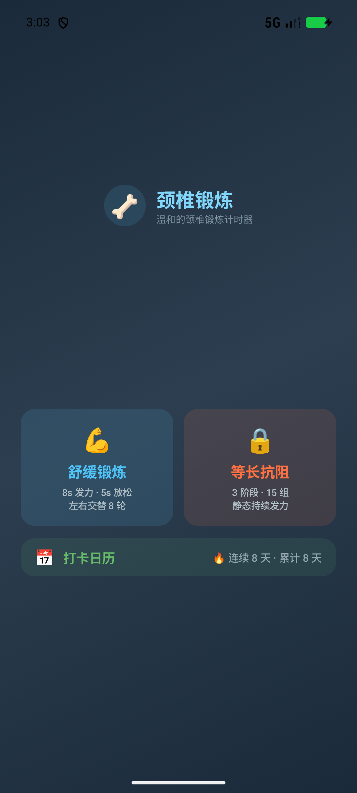
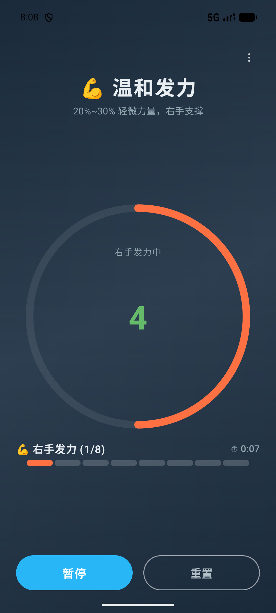
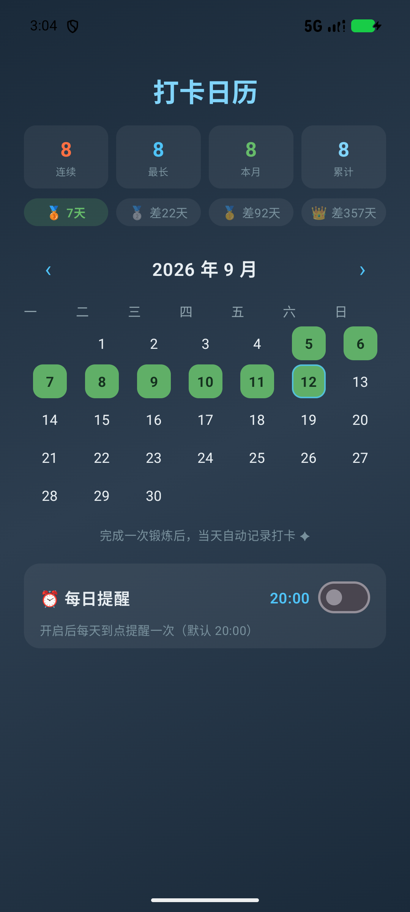
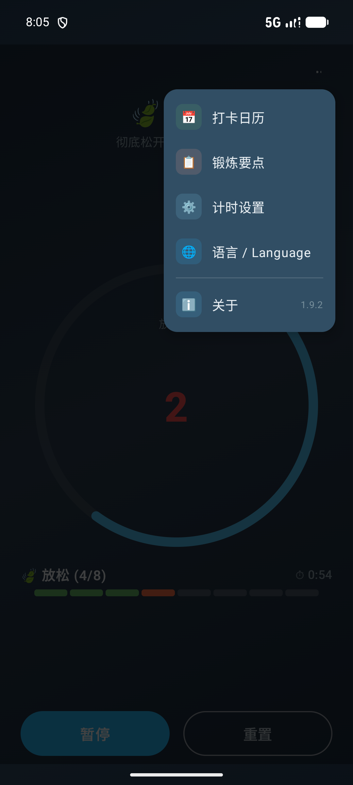

# 🦴 颈椎锻炼 · Neck Exercise Timer

> 温和的颈椎锻炼计时器 —— 专为久坐人群设计的等长收缩训练助手，跟着语音节奏，每天几分钟，给颈椎做一套完整的"拉伸操"。

**中文** | [English](README_EN.md)

 -green) -orange)  

## 📸 界面预览

| 首页 | 锻炼中 |
|:---:|:---:|
|  |  |

| 打卡日历 | 菜单 |
|:---:|:---:|
|  |  |

## ✨ 功能特性

### 🏋️ 两种锻炼模式

| 模式 | 内容 | 时长 |
|---|---|---|
| **舒缓锻炼** | 温和发力 8s ⇄ 放松 5s，左右手交替 8 轮 | ≈ 1 分 44 秒 |
| **等长抗阻** | 正向抗阻 → 侧向抗阻 → 弹力带训练，3 阶段共 15 组 | ≈ 8 分钟 |

- **语音引导**：开始/换手/放松/阶段切换/完成全程 TTS 播报，支持**中/英双语**（跟随系统语言，⋮ 菜单可切换），不用盯屏幕
- **音效提示**：阶段切换音、最后 3 秒滴声、完成三连音
- **零漂移计时**：锚点时间戳驱动，中途暂停/息屏再回来，倒计时依然精确
- **屏幕常亮**：锻炼进行中自动保持屏幕唤醒，结束即恢复

### 📅 打卡日历

- 完成锻炼**自动打卡**，按天去重；月历视图，今日高亮描边
- **连续打卡**（当天未练不断签）与**最长连续**统计
- **按模式统计**：舒缓 / 等长抗阻分别计数（本月 + 累计），打卡格显示模式小圆点（青=舒缓，橙=等长抗阻）
- **里程碑徽章**：🥉 7 天 / 🥈 30 天 / 🥇 100 天 / 👑 365 天
- 打卡历史本地持久化，重启不丢失（紧凑 `base36` 序列化，一条字符串存全部历史；v2 每天带模式位掩码，旧数据兼容）

### ⏰ 每日提醒

- 日历页设置提醒时间（默认 20:00），到点**系统通知**提醒锻炼
- `setAlarmClock` **精确闹钟**：准点触发、可穿 Doze、状态栏显示闹钟图标
- **当天已打卡自动跳过**——只提醒没练的日子，不打扰坚持中的人
- 重启自动重排；触发后接收器自动续期次日，链式触发永不断档

### ⚙️ 运行时可调

- 计时页 ⋮ 菜单 → **计时设置**：准备/发力/放松/组数全部可用步进器调整
- 保存即持久化（下次启动依然生效），支持一键恢复默认
- 所有时长同时由 JSON 配置驱动（`TimingConfig` 内嵌默认值 + 手写解析器），改配置无需改代码
- **中/英双语界面**：默认跟随系统语言，应用内 ⋮ → 「语言」可手动切换并记忆

## 📱 安装

从 [Releases](../../releases) 页面下载 `app-release.apk`（Android 8.0+），安装即可，无需任何权限外的配置。

## 🔨 构建

```powershell
# 本仓库根目录执行
.\run-tests.ps1                     # 63 个单元测试
.\build-release.ps1                 # 签名 release APK（密钥读 local.properties）
gradle.bat ':app:assembleDebug'     # 或直接 gradle 打 debug 包
```

> 签名配置读取 `local.properties`（不入库）：`SPINE_STORE_FILE/SPINE_STORE_PWD`、`SPINE_KEY_ALIAS/SPINE_KEY_PWD`。

## 🏗️ 技术架构

**零第三方依赖**是本项目的执念：仅用 Compose + 平台 API，JSON 解析器是手写的，连通知都走平台 `Notification.Builder`。

```
app/src/main/java/com/spineexercise/timer/
├── WorkoutEngine.kt    # 纯 Kotlin 状态机：锚点计时、事件输出，无 Android 依赖
├── TimingConfig.kt     # JSON 时长配置 + 手写解析器/序列化器（往返一致）
├── L10n.kt             # 中英双语字符串包 + 阶段/方向名本地化查表
├── L10nStore.kt        # 语言选择持久化（SharedPreferences）+ 系统语言探测
├── CheckIn.kt          # 打卡日志：TreeSet<epochDay> + v2:base36 紧凑序列化（含模式位掩码）
├── CheckInStore.kt     # SharedPreferences 持久化桥
├── ReminderPolicy.kt   # 提醒决策纯函数（shouldNotify / nextTriggerAt）
├── ReminderScheduler.kt# setAlarmClock 精确闹钟链
├── TimerViewModel.kt   # 唯一的 Android 桥：tick 驱动引擎 + TTS/音效
└── MainActivity.kt     # Compose UI（首页/计时/日历/菜单）
```

几个值得一提的设计：

- **引擎零分支**：舒缓模式就是"单阶段配置"，与等长抗阻共用同一条 `advanceGroup()` 推进路径——加新模式只需加 JSON，不用动引擎
- **播报即事件**：语音/音效以 `EngineEvent` 从引擎输出，ViewModel 只负责播放——引擎可以在 JVM 上直接单测
- **动画全部 draw-phase**：脉冲/呼吸动画通过 `graphicsLayer` lambda 读取，每帧零重组；实测 GPU 下持续动画 59fps / 0.9% 卡顿
- **打卡一条字符串**：全部历史序列化为 `v2:fz7.1,fz8.3,...`（base36 epochDay + 每日模式位掩码），读写一次搞定
- **双语即查表**：阶段/方向名以规范中文配置为源，显示/播报时查表本地化，未知名原样透传

更完整的规格说明（状态机、语音播报表、时长配置 schema）见 [`CLAUDE.md`](CLAUDE.md)；功能开发过程记录见 [`docs/compose/spec/`](docs/compose/spec/)。

## 🧪 测试

63 个 JUnit 单元测试（`app/src/test/`）覆盖：状态机全流程（舒缓播报序列逐字断言/等长三阶段切换/暂停恢复/计时抖动/英文播报）、打卡逻辑（去重/跨月/streak 宽限规则/模式位掩码/序列化容错）、提醒策略（跨天滚动/已打卡跳过）、JSON 解析往返、双语字符串包（语言切换/阶段方向名查表/TTS Locale）。

## 📄 项目结构

```
├── README.md              # 本文件
├── README_EN.md           # 英文版说明
├── CLAUDE.md              # 详细技术规格（状态机/播报/配置 schema）
├── screenshots/           # 界面截图
├── docs/compose/spec/     # 功能开发文档
├── app/                   # Android 应用模块
├── run-tests.ps1          # 单测脚本
└── build-release.ps1      # 签名构建脚本
```

## 🗺️ Roadmap

- [ ] 年度打卡热力图
- [ ] 锻炼数据统计（每周时长/完成率）
- [ ] 配套 Web 版（同 JSON 配置驱动）
