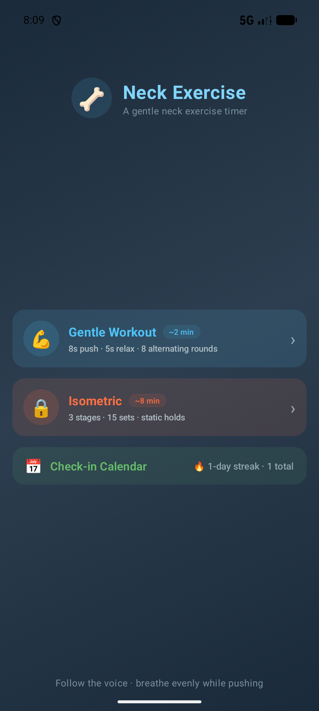
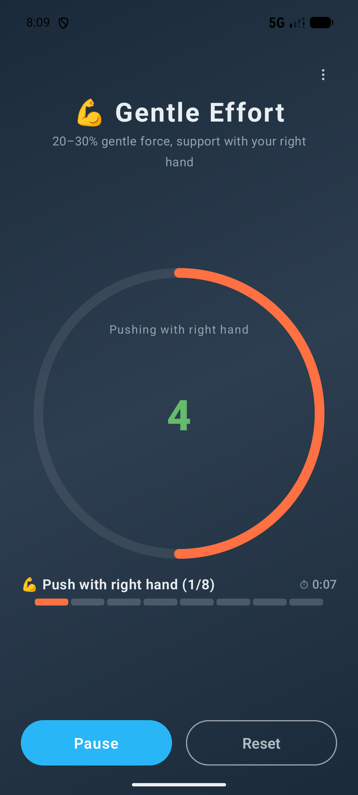
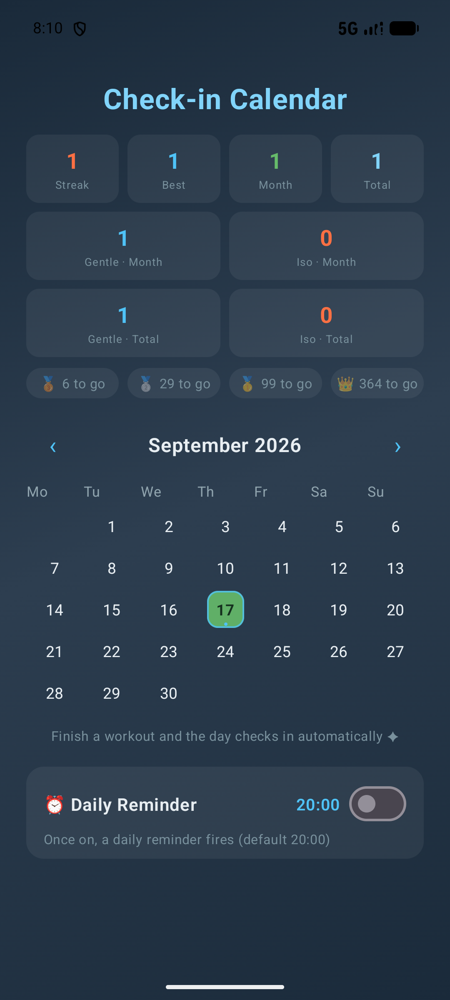
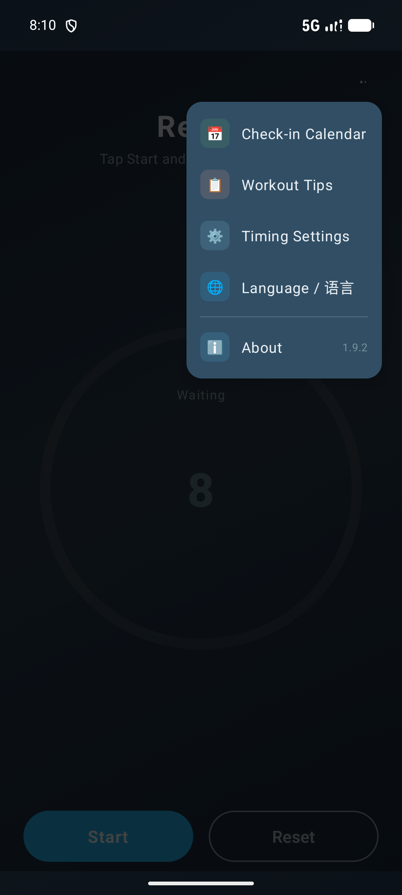

# 🦴 颈椎锻炼 · Neck Exercise Timer

> A gentle neck exercise timer — an isometric training companion for desk workers. Follow the voice rhythm, a few minutes a day, and give your cervical spine a complete "stretch routine".

[中文](README.md) | **English**

 -green) -orange)  

## 📸 Screenshots

| Home | Workout |
|:---:|:---:|
|  |  |

| Check-in Calendar | Menu |
|:---:|:---:|
|  |  |

## ✨ Features

### 🏋️ Two Workout Modes

| Mode | Content | Duration |
|---|---|---|
| **Gentle Workout** | Gentle push 8s ⇄ relax 5s, alternating hands for 8 rounds | ≈ 1 min 44 s |
| **Isometric** | Front resistance → side resistance → resistance band, 3 stages / 15 sets | ≈ 8 min |

- **Voice guidance**: start / hand switch / relax / stage switch / finish — full TTS narration in **Chinese or English** (follows the system language, or switch manually in the ⋮ menu); no need to watch the screen
- **Sound cues**: stage-switch tone, last-3-seconds beeps, finish triple chime
- **Zero-drift timing**: driven by anchor timestamps — pause mid-set or let the screen sleep, the countdown stays exact
- **Screen stays awake** while a workout runs, restored automatically when done

### 📅 Check-in Calendar

- Workouts **check in automatically**, deduplicated per day; month view with today outlined
- **Current streak** (a missed day doesn't erase history) and **best streak** stats
- **Milestone badges**: 🥉 7 days / 🥈 30 days / 🥇 100 days / 👑 365 days
- **Per-mode stats**: gentle / isometric counts by month and in total; calendar pins (cyan = gentle, orange = isometric)
- History persists locally across relaunches (compact `base36` v2 serialization — the whole log lives in one string, with a per-day mode bitmask; legacy v1 entries still count toward day stats)

### ⏰ Daily Reminder

- Pick a time on the calendar page (default 20:00) — a **system notification** reminds you to work out
- `setAlarmClock` **exact alarm**: fires on time, survives Doze, shows the alarm icon in the status bar
- **Auto-skipped on checked-in days** — it only nudges days you haven't trained
- Re-armed after reboot; the receiver re-arms tomorrow after each fire, so the chain never breaks

### ⚙️ Runtime Tunable & Bilingual

- Timer page ⋮ menu → **Timing Settings**: prepare / push / relax / sets all adjustable with steppers
- Saved instantly (survives relaunch), one-tap **restore defaults**
- All durations are driven by a JSON config (`TimingConfig` embedded defaults + hand-written parser) — tune timings without touching code
- **中文 / English UI**: follows the system language by default, with an in-app switch (⋮ → Language) that persists

## 📱 Install

Download `app-release.apk` from the [Releases](../../releases) page (Android 8.0+) and install — no extra configuration or permissions needed.

## 🔨 Build

```powershell
# run from the repo root
.\run-tests.ps1                     # 63 unit tests
.\build-release.ps1                 # signed release APK (keys from local.properties)
gradle.bat ':app:assembleDebug'     # or build a debug APK directly with gradle
```

> Signing config is read from `local.properties` (not committed): `SPINE_STORE_FILE/SPINE_STORE_PWD`, `SPINE_KEY_ALIAS/SPINE_KEY_PWD`.

## 🏗️ Architecture

**Zero third-party dependencies** is the project's obsession: Compose + platform APIs only, the JSON parser is hand-written, even notifications go through the platform `Notification.Builder`.

```
app/src/main/java/com/spineexercise/timer/
├── WorkoutEngine.kt    # Pure-Kotlin state machine: anchor timing, event output, no Android deps
├── TimingConfig.kt     # JSON timing config + hand-written parser/serializer (round-trip safe)
├── L10n.kt             # Bilingual string bundle (Chinese/English) + stage/direction name lookup
├── L10nStore.kt        # Language persistence (SharedPreferences) + system-locale detection
├── CheckIn.kt          # Check-in log: TreeSet<epochDay> + v2:base36 serialization with mode bitmask
├── CheckInStore.kt     # SharedPreferences persistence bridge
├── ReminderPolicy.kt   # Reminder decision pure functions (shouldNotify / nextTriggerAt)
├── ReminderScheduler.kt# setAlarmClock exact-alarm chain
├── TimerViewModel.kt   # The only Android bridge: tick drives engine + TTS/sound effects
└── MainActivity.kt     # Compose UI (home / timer / calendar / menu)
```

A few design points worth mentioning:

- **Zero-branch engine**: the gentle mode is just a "single-stage config" and shares the same `advanceGroup()` advance path as isometric — adding a new mode only needs more JSON, no engine changes
- **Announcements as events**: voice/sound effects leave the engine as `EngineEvent`s; the ViewModel only plays them — so the engine unit-tests directly on the JVM
- **Draw-phase animations**: pulse/breathe animations are read through `graphicsLayer` lambdas — zero recomposition per frame; measured 59 fps / 0.9% jank under GPU
- **One-string check-in log**: the whole history serializes as `v2:fz7.1,fz8.3,...` (base36 epochDay + mode bitmask), read/written in one shot
- **Bilingual by lookup**: stage/direction names come from the canonical Chinese config and are localized at display/announcement time — unknown names pass through unchanged

For the full spec (state machine, announcement tables, timing-config schema) see [`CLAUDE.md`](CLAUDE.md); feature development logs live in [`docs/compose/spec/`](docs/compose/spec/).

## 🧪 Tests

63 JUnit unit tests (`app/src/test/`) cover: the full state machine (verbatim gentle announcement sequence / isometric three-stage switching / pause & resume / timing jitter / English announcements), check-in logic (dedup / cross-month / streak grace rules / per-mode masks / serialization fallbacks), reminder policy (day rollover / skip-if-checked-in), JSON parse round-trips, and the bilingual string bundle (language switch, stage/direction lookup, TTS locale).

## 📄 Project Layout

```
├── README.md              # Chinese README
├── README_EN.md           # this file (English)
├── CLAUDE.md              # detailed technical spec (state machine / announcements / config schema)
├── screenshots/           # UI screenshots
├── docs/compose/spec/     # feature development docs
├── app/                   # the Android app module
├── run-tests.ps1          # unit-test script
└── build-release.ps1      # signed-build script
```

## 🗺️ Roadmap

- [ ] Yearly check-in heatmap
- [ ] Workout statistics (weekly duration / completion rate)
- [ ] Web version with i18n (same JSON config; Android already ships 中文/English)
